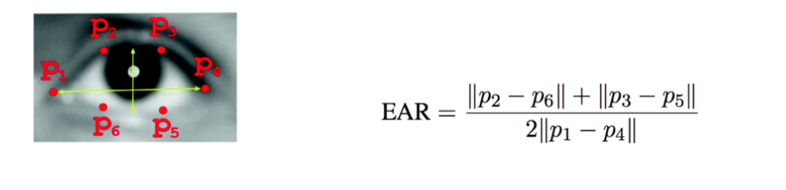

# Drowsiness detection

This project aims to detect and alert the user when a person's eyes are closed for an extended period, indicating possible drowsiness or fatigue. This is achieved by using facial landmarks and computing the eye aspect ratio (EAR), which is a measure of how open the eyes are. If the calculated EAR falls below a certain threshold consistently for a specified number of frames, an alert is triggered.

## Features:

1. **Eye Aspect Ratio (EAR) Calculation:**
The project calculates the EAR, a reliable measure of eye openness, by analyzing the positions of facial landmarks. This enables the detection of closed or partially closed eyes, a crucial indicator of drowsiness.
    
    
    
2. **Real-Time Video Processing:**
The system processes video frames from a webcam feed in real-time, ensuring continuous monitoring of the person's eyes and immediate detection of potential drowsiness.
3. **Alert Mechanism:**
When the calculated average EAR drops below a predefined threshold for a set number of consecutive frames, the system triggers an alert. This visual and auditory alert serves as a timely warning for potential drowsiness.
4. **Adjustable Thresholds:**
The threshold value for identifying closed eyes is customisable, allowing users to fine-tune the sensitivity of the drowsiness detection system based on their preferences and application requirements.
5. **Frame Check Interval:**
The system counts the consecutive frames in which the EAR remains below the threshold. This prevents brief blinks or fluctuations in the EAR from causing false alarms.
6. **User-Friendly Display:**
The video frame with visualized eye contours and alert messages is displayed interactively using OpenCV. This user-friendly display allows users to observe the system's analysis of eye behavior in real time.
7. **Dependency on Open-Source Libraries:**
The project utilizes established open-source libraries like dlib, imutils, and pygame.mixer, streamlining the implementation process and building upon the functionalities they offer.

## Installation:

1. Clone the repository:
    
    ```
    git clone https://github.com/gxutxm/Drowsiness-detection.git
    ```
    
2. Install the required dependencies:
    
    `pip install -r requirements.txt`
    

## Usage:

1. Open the terminal and navigate to the project directory.
2. Run the functionality that you would like to perform. For example,
    
    ```
    python3 Drowsiness_Detection.py
    ```
    
3. The script will initialise the camera and start capturing frames.
4. Perform opening and closing of eyes to invoke the alert.

## Result:

https://github.com/gxutxm/Drowsiness-detection/assets/81068888/02ec4ebf-1e09-474d-a420-3caaf9250f29


    

## Project Structure:

```
DrowsinessDetectionProject/   # Main project directory
├── music.wav                  # Alert sound file
├── models/                    # Directory for model files
│   └── shape_predictor_68_face_landmarks.dat  # Pretrained model offacial landmark prediction
├── drowsiness_detection.py    # Python script for drowsiness detection
```
